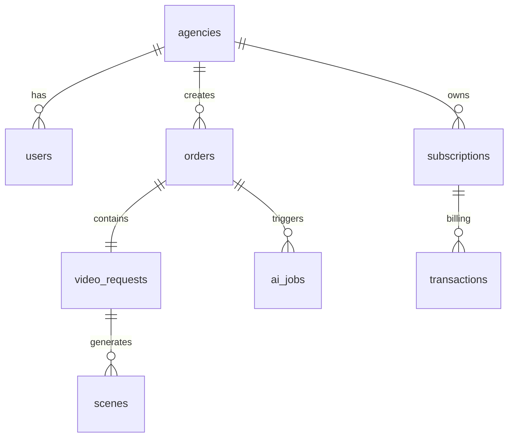
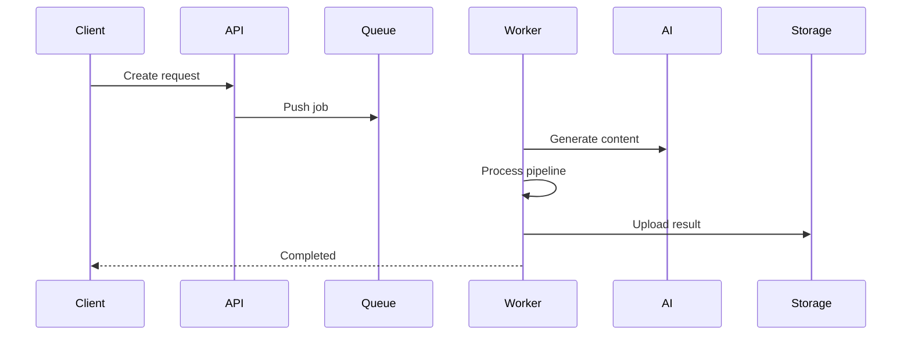

# 🚀 Nexivion Labs

  

---

## 🧠 Building the AI Operating System for Creative Production

**Nexivion** is an AI-native infrastructure for automated content and media production.

This is not just a video generator.
It is a **multi-tenant AI production engine** designed to run like an autonomous system.

Built for:

* Agencies
* Creators
* AI-native startups
* Future creative platforms

The goal is to build backend systems that can **think, generate, optimize and deliver** content with minimal human intervention.

> Long-term vision: become the infrastructure layer behind next-generation AI creative tools.

---

# 🧠 Vision

Nexivion is an AI-first platform and developer ecosystem focused on building intelligent digital systems and tools for developers.

I aim to contribute to open-source communities and build scalable AI-driven products.

---

# 👨‍💻 About

<table>
<tr>
<td width="220">

</td>
<td>

### Fatih Özgel

**Full-Stack Systems Engineer (AI & Scalable Platforms)**

I build complete software systems — not just parts of them.

From backend architecture to AI pipelines, frontend, mobile, and infrastructure,
I design and develop **end-to-end intelligent systems** that can scale and operate reliably.

### Engineering approach

* Build systems, not isolated features
* Design scalable architectures
* Integrate AI as core infrastructure
* Focus on performance & reliability
* Think product-first, system-first

I work across the entire stack and treat software as a complete ecosystem rather than separated layers.

</td>
</tr>
</table>

---

## 🧠 Engineering Focus

* Full-stack software architecture
* AI-integrated applications
* Autonomous content pipelines
* Scalable SaaS systems
* System design & performance
* Product-oriented engineering

---

# 🧠 Tech Stack

## 🔧 Backend & AI

  
  
  
  
  

---

## 🎨 Frontend, Mobile & Client Platforms

  
  
  
  
  
  
  
  
  

  
  
  
  
  
  

I build **end-to-end client applications** covering mobile, web, and desktop platforms.
Focused on real-time interfaces, scalable dashboards, and production-grade UX.

---

## 🛠 Tools, Platform & Infrastructure

  
  
  
  
  
  
  
  
  
  

  
  
  
  

I build **production-ready infrastructure** focused on reliability, scalability and automation.
Everything is designed to run async, cost-aware and cloud-ready.

---

# 🚀 Nexivion AI Production Infrastructure

AI-first backend architecture designed to generate, process and deliver content through autonomous pipelines.

This project represents a scalable **AI production infrastructure** rather than a single application.

---

# 🏗️ AI-Native SaaS Architecture

Nexivion is designed as a **multi-tenant AI production infrastructure**.

### Core architecture decisions

* Multi-agency tenant structure
* Credit & subscription system
* AI cost tracking per scene
* Queue-based async processing
* WebSocket live progress
* Asset & template system
* Provider-agnostic AI integration

### Why this matters

Most AI tools generate content.
Nexivion generates and manages **entire production pipelines**.

This enables:

* predictable cost control
* scalable generation
* automated delivery
* analytics & optimization
* system-level automation

---

# 🏗️ Core System Architecture

This is the core architecture behind Nexivion AI.
Designed as a scalable multi-tenant AI production system.

---

# ⚡ Autonomous AI Pipeline

From a single request the system can:

1. Generate script via LLM
2. Create scenes
3. Generate visuals
4. Animate scenes
5. Generate voice
6. Compose final video
7. Quality check
8. Deliver automatically

All steps run asynchronously and are cost-tracked.

## Orchestration Flow

---

# 📊 GitHub Stats

  

---

# 🌍 Ecosystem & Future

* AI-native SaaS infrastructure
* Developer SDK & tools
* Template & automation system
* Scalable production pipelines
* Open developer ecosystem

---

# 🌐 Connect

---

# 🧬 Long-Term Direction

Building scalable AI systems.
Building autonomous software infrastructure.
Building in public.

> Systems first.
> Scale always.
> Software without limits.
