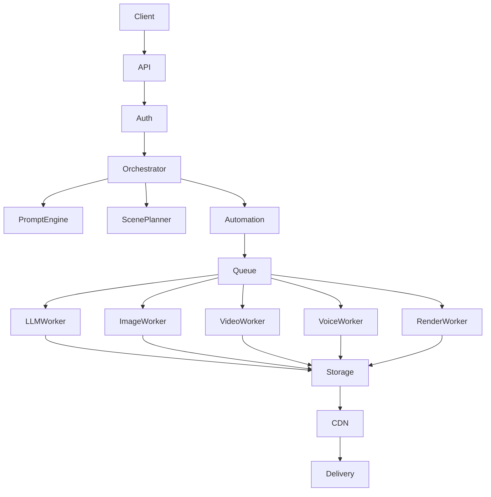
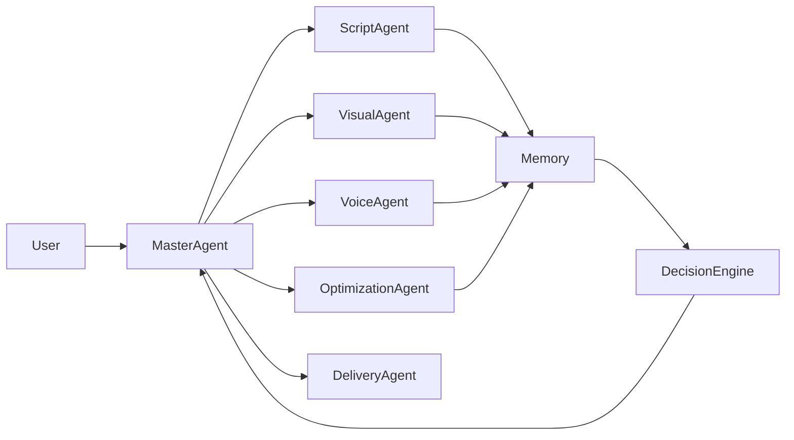
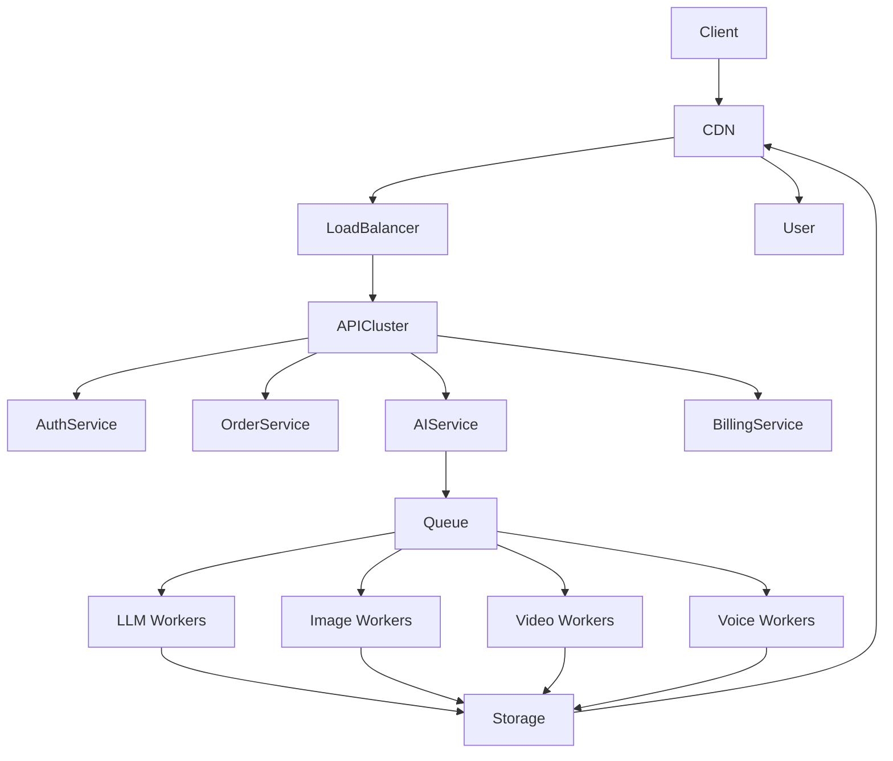

# 🚀 Nexivion Labs

  

<b>💻 Full-Stack Systems Engineer | 🧠 AI Systems Builder | 🚀 Startup Builder</b>

---

# 🧠 Nexivion AI Operating System

Nexivion is an **AI-native operating system for automated content and media production**.

This is not just a generator.
It is a **scalable multi-tenant AI infrastructure** designed to run autonomous production pipelines.

Built for:

* Agencies
* Creators
* AI-native startups
* Future SaaS platforms

> Vision: Become the infrastructure layer behind next-generation AI products.

---

# 🧠 AI OS CORE ARCHITECTURE

---

# 🤖 AI AGENT SYSTEM

---

# 🏗 SCALABLE SYSTEM DESIGN

---

# 👨‍💻 About

<table>
<tr>
<td width="220">

</td>
<td>

### Fatih Özgel

**Full-Stack Systems Engineer — AI & Scalable Platforms**

I build complete software systems — not just isolated features.

From backend architecture and AI pipelines to frontend and infrastructure,
I design **end-to-end intelligent systems** that scale and operate autonomously.

### Engineering mindset

* Systems > features
* Architecture-first
* AI as core infrastructure
* Performance & scalability
* Product-oriented engineering

I treat software as a complete ecosystem rather than separated layers.

</td>
</tr>
</table>

---

# 🧠 Engineering Focus

* AI infrastructure & autonomous systems
* Full-stack architecture
* Multi-tenant SaaS systems
* Distributed workers & queues
* AI orchestration engines
* Scalable production pipelines

---

# 🧠 Tech Stack

## Backend & AI

## Frontend & Client

## Infrastructure

---

# 📊 GitHub Stats

---

# 🌐 Connect

---

# 🧬 Long-Term Direction

Building scalable AI systems.
Building autonomous software infrastructure.
Building the future AI stack.

> Systems first.
> Scale always.
> Software without limits.
