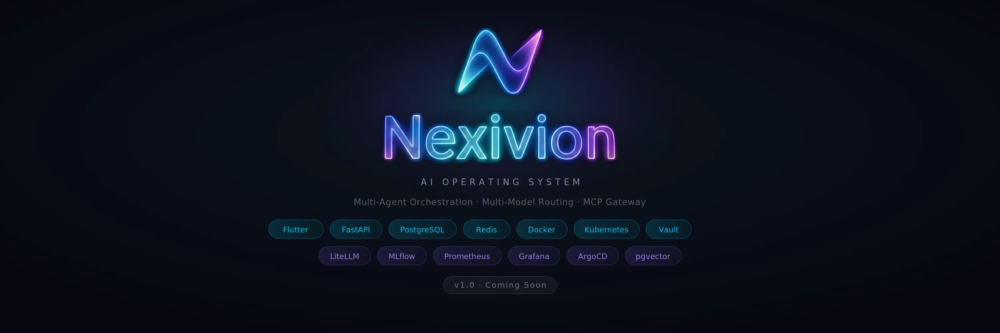
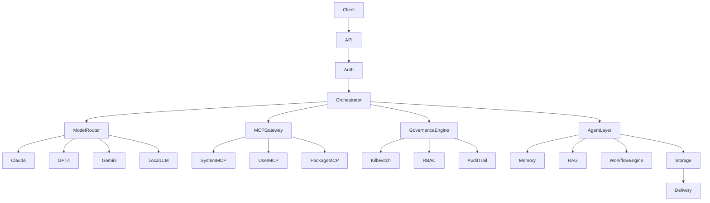
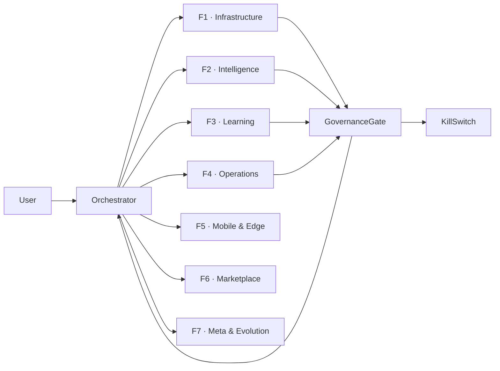
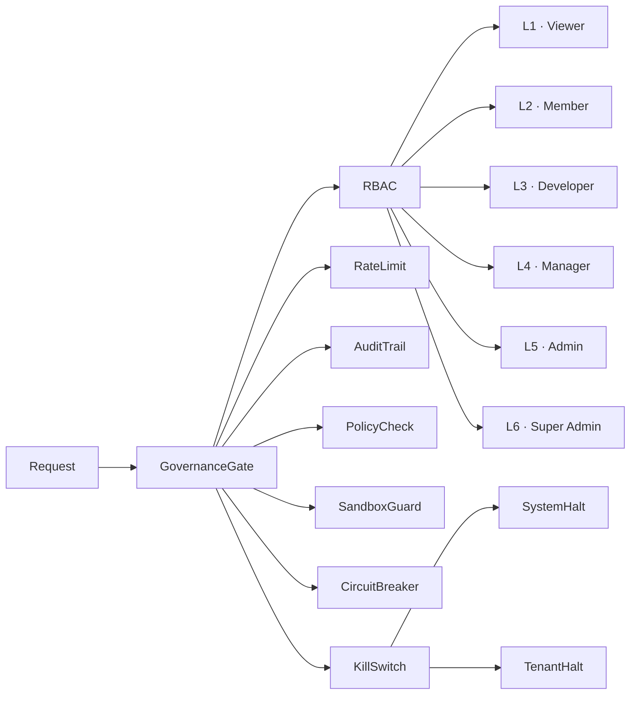

# 🚀 Nexivion Labs

  

  

  <b>💻 Full-Stack Systems Engineer &nbsp;|&nbsp; 🧠 AI Infrastructure Builder &nbsp;|&nbsp; 🚀 Startup Founder</b>

---

## 🧠 Nexivion AI Operating System

Nexivion is an **enterprise-grade AI Operating System** — a governance-aware, multi-agent orchestration platform designed to run intelligent workflows at scale.

Not just an AI tool. A complete **AI infrastructure layer** built for teams that need control, observability, and autonomy in a single system.

  
  
  
  
  

---

## 🏗️ System Architecture

```mermaid
flowchart TB
    Client --> API
    API --> Auth
    Auth --> Orchestrator

    Orchestrator --> ModelRouter
    Orchestrator --> MCPGateway
    Orchestrator --> GovernanceEngine

    ModelRouter --> Claude
    ModelRouter --> GPT4
    ModelRouter --> Gemini
    ModelRouter --> LocalLLM

    MCPGateway --> SystemMCP
    MCPGateway --> UserMCP
    MCPGateway --> PackageMCP

    GovernanceEngine --> KillSwitch
    GovernanceEngine --> RBAC
    GovernanceEngine --> AuditTrail

    Orchestrator --> AgentLayer
    AgentLayer --> Memory
    AgentLayer --> RAG
    AgentLayer --> WorkflowEngine

    AgentLayer --> Storage
    Storage --> Delivery
```

---

## 🤖 Multi-Agent Orchestration

```mermaid
flowchart LR
    User --> Orchestrator

    Orchestrator --> F1[F1 · Infrastructure]
    Orchestrator --> F2[F2 · Intelligence]
    Orchestrator --> F3[F3 · Learning]
    Orchestrator --> F4[F4 · Operations]
    Orchestrator --> F5[F5 · Mobile & Edge]
    Orchestrator --> F6[F6 · Marketplace]
    Orchestrator --> F7[F7 · Meta & Evolution]

    F1 --> GovernanceGate
    F2 --> GovernanceGate
    F3 --> GovernanceGate
    F4 --> GovernanceGate

    GovernanceGate --> KillSwitch
    GovernanceGate --> Orchestrator
```

---

## 📦 7-Phase Roadmap

| Phase | Layer | Focus | Status |
|-------|-------|-------|--------|
| F1 | Infrastructure | Auth, MCP Gateway, RAG, Orchestrator core | 🔵 Planned |
| F2 | Intelligence | Model Router, Context Manager, NLI Pipeline | 🔵 Planned |
| F3 | Learning | Feedback, Debate, Self-Healing, Metrics | 🔵 Planned |
| F4 | Operations | Security, Monitoring, Capacity, Status | 🔵 Planned |
| F5 | Mobile & Edge | Offline agent, Voice, Device Management | 🔵 Planned |
| F6 | Marketplace | Developer Portal, Billing, Community | 🔵 Planned |
| F7 | Meta & Evolution | Federation, Multi-Region, Security Command | 🔵 Planned |

---

## 🔐 Governance & Security

```mermaid
flowchart LR
    Request --> GovernanceGate

    GovernanceGate --> RBAC
    GovernanceGate --> RateLimit
    GovernanceGate --> AuditTrail
    GovernanceGate --> PolicyCheck
    GovernanceGate --> SandboxGuard
    GovernanceGate --> CircuitBreaker

    RBAC --> L1[L1 · Viewer]
    RBAC --> L2[L2 · Member]
    RBAC --> L3[L3 · Developer]
    RBAC --> L4[L4 · Manager]
    RBAC --> L5[L5 · Admin]
    RBAC --> L6[L6 · Super Admin]

    GovernanceGate --> KillSwitch
    KillSwitch --> SystemHalt
    KillSwitch --> TenantHalt
```

---

## 👨‍💻 About

### Fatih Özgel
**Full-Stack Systems Engineer — AI Infrastructure & Scalable Platforms**

I build complete software systems — not just isolated features.
From backend architecture and AI pipelines to frontend and infrastructure,
I design **end-to-end intelligent systems** that scale and operate autonomously.

**Engineering mindset:**
- Systems > features
- Architecture-first, spec-driven development
- AI as core infrastructure, not a plugin
- Governance and observability by default
- Product-oriented engineering at every layer

---

## 🛠️ Tech Stack

### Languages

### Backend & API

### Frontend & Mobile

### AI & ML

### Databases & Storage

### DevOps & Infrastructure

### Observability & Security

### Cloud

---

## 🔨 Currently Building

  

| Project | Description | Status |
|---------|-------------|--------|
| **Nexivion AI OS** | Enterprise AI Operating System — 60+ agents, multi-model routing, MCP Gateway | 🔵 Pre-coding · Spec complete |
| **Nexivion CLI** | Developer CLI for agent deployment and workflow automation | 🔵 Planned · F1 |
| **Nexivion Marketplace** | Agent & tool marketplace for the ecosystem | 🔵 Planned · F6 |

---

## 🌟 Open Source · Coming Soon

Nexivion AI OS will be **fully open source** when v1.0 launches.

If you're interested in:
- 🤖 Multi-agent orchestration systems
- 🔀 Multi-model AI routing
- 🔌 MCP Gateway architecture
- 🛡️ Governance-aware AI infrastructure
- 📱 Flutter + FastAPI full-stack AI apps

**Watch this repo** — early contributors will shape the foundation.

  
  

---

## 📊 GitHub Stats

  

---

## 🌐 Connect

---

## 🧬 Vision

> The next generation of software won't be written line by line.
> It will be orchestrated — by intelligent agents, governed by principles, scaled by infrastructure.
>
> Nexivion is that infrastructure.

**Systems first. Scale always. Intelligence by design.**
