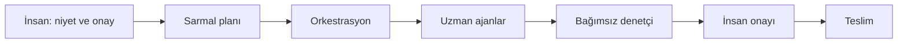
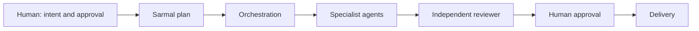
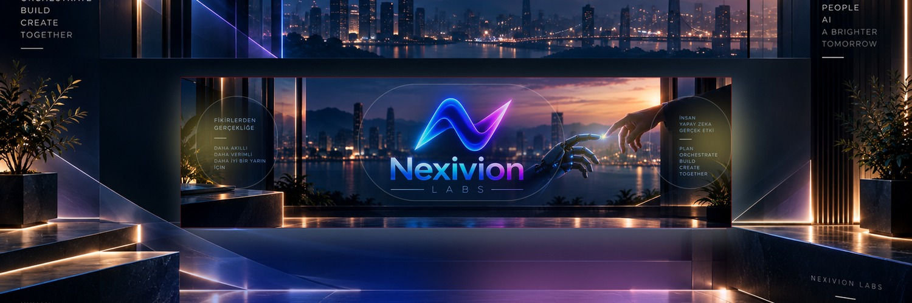

# Nexivion Labs

  

  <b>Tüm yapay zekâ araçları tek orkestrasyon çatısı altında.</b> 
  <i>Every AI tool under one orchestration roof.</i>

  <a href="#tr"><b>Türkçe</b></a> &nbsp;·&nbsp; <a href="#en"><b>English</b></a>

---

## Türkçe

İnsan ve yapay zekânın birlikte çalıştığı yeni nesil yazılım sistemleri geliştiriyoruz.

### Sarmal: ajan fabrikası

Sarmal, yapay zekâ ajanlarını tek bir plan etrafında çalıştıran bir orkestrasyon sistemidir. Bir işi plandan başlatır, işi doğru uzman ajana verir, üretilen işi bağımsız bir denetçiye ölçtürür ve insan onayı olmadan hiçbir şeyi yayına almaz.

Sarmal'ın kadrosunda web, Android, iOS ve masaüstü uygulamaları geliştiren yazılım uzmanı ajanlar, otonom sistemler ve Meta ile Google Ads gibi iş otomasyonları yer alır. Amacımız, insanların yapay zekâ araçlarından en yüksek verimi almasını ve otomasyonlarını tek bir yerden kurabilmesini sağlamaktır.

Sarmal bugün açık kaynaklı bir planlama dili, bir motor ve bir VS Code eklentisidir. Masaüstü, web ve mobil uygulamaları da açık bir süreçle, YouTube kanalımızda kayda alınarak inşa ediliyor.

**Açık kaynak depo:** [github.com/nexivion-labs/sarmal](https://github.com/nexivion-labs/sarmal)

  
  

#### Neyi çözüyoruz?

Yapay zekâya iş yaptırırken asıl sorun modelin zekâsı değil, niyetin kaybolmasıdır. Plan bir yerde yazılıdır, kod başka bir yere gider ve aradaki farkı kimse görmez. Sarmal projenin niyetini makinenin okuyabildiği bir dille yazdırır ve bir motor sürekli şunu sorar: planın söylediği ile diskteki gerçek hâlâ aynı mı?

```mermaid
flowchart LR
    Insan[İnsan: niyet ve onay] --> Plan[Sarmal planı]
    Plan --> Orkestra[Orkestrasyon]
    Orkestra --> Ajanlar[Uzman ajanlar]
    Ajanlar --> Denetci[Bağımsız denetçi]
    Denetci --> Onay[İnsan onayı]
    Onay --> Teslim[Teslim]
```

---

### Hakkımda

#### Fatih Özgel
**Sistem mühendisi, Nexivion Labs kurucusu**

Tek tek özellikler değil, uçtan uca çalışan yazılım sistemleri kuruyorum. Arka uç mimarisinden yapay zekâ hatlarına, arayüzden altyapıya kadar bütün katmanları birlikte tasarlıyorum.

Çalışma ilkelerim şunlar: önce sistem, sonra özellik; önce mimari ve plan, sonra kod; yapay zekâ bir eklenti değil, sistemin çekirdeğidir; yönetişim ve gözlemlenebilirlik baştan gelir.

---

## English

We build next-generation software systems where humans and AI work together.

### Sarmal: the agent factory

Sarmal is an orchestration system that runs AI agents around a single plan. It starts every job from the plan, hands the work to the right specialist agent, has an independent reviewer measure the result, and publishes nothing without human approval.

Sarmal's crew includes specialist software agents that build web, Android, iOS and desktop applications, autonomous systems, and business automations such as Meta and Google Ads management. Our goal is to help people get the most out of AI tools and set up their automations from a single place.

Today Sarmal is an open-source planning language, an engine and a VS Code extension. Its desktop, web and mobile apps are being built in the open and recorded on our YouTube channel.

**Open-source repository:** [github.com/nexivion-labs/sarmal](https://github.com/nexivion-labs/sarmal)

  
  

#### What problem do we solve?

When you put AI to work, the real problem is not the model's intelligence but the loss of intent. The plan lives in one place, the code goes somewhere else, and nobody sees the gap between them. Sarmal writes the project's intent in a language machines can read, and an engine keeps asking one question: does what the plan says still match what is on disk?

```mermaid
flowchart LR
    Human[Human: intent and approval] --> Plan[Sarmal plan]
    Plan --> Orchestration[Orchestration]
    Orchestration --> Agents[Specialist agents]
    Agents --> Reviewer[Independent reviewer]
    Reviewer --> Approval[Human approval]
    Approval --> Delivery[Delivery]
```

### About me

#### Fatih Özgel
**Systems engineer, founder of Nexivion Labs**

I build complete software systems that work end to end, not isolated features. I design every layer together, from backend architecture and AI pipelines to the interface and the infrastructure.

My working principles: system first, features second; architecture and plan first, code second; AI is the core of the system, not a plugin; governance and observability come from day one.

---

## Teknolojiler · Tech stack

---

## Bize ulaşın · Get in touch

Yazılım ya da otomasyon kurmak istiyorsanız bize yazın. 
<i>If you want to build software or automation, write to us.</i>

---

> Yazılımın geleceği satır satır yazılmayacak. Akıllı ajanlarla orkestre edilecek, ilkelerle yönetilecek ve insan onayıyla teslim edilecek.
>
> *The future of software will not be written line by line. It will be orchestrated by intelligent agents, governed by principles and delivered with human approval.*

**Nexivion Labs. İnsan ve yapay zekânın birlikte ürettiği gelecek.** 
*The future built by humans and AI together.*

  

